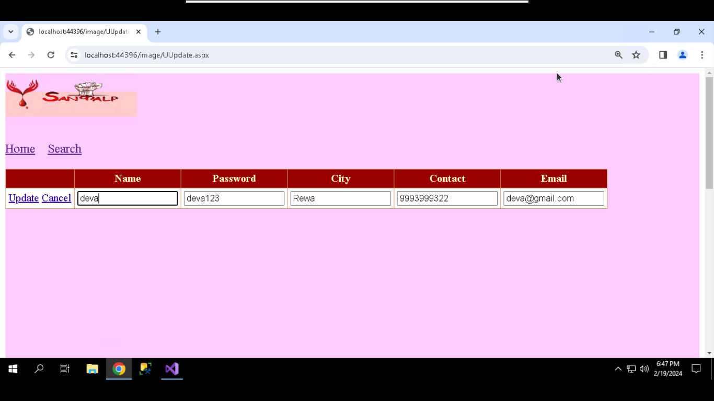

# Blood-Donor
### About
Developed a user-friendly web application connecting blood donors with recipients in realtime. Users can sign up, request blood donations, and admins manage user accounts.
Implemented features include enhanced account security, privacy measures for contact details,
and efficient search functionality based on location and blood group. Achievements include
creating a successful platform for donor-recipient interaction and implementing a fair
distribution system.

### Technology used
Asp.Net,Ado.Net,C# And Sql Server

### Interface Of Application

#### Home Page

- From here user can Register,search and User or Admin Login directly

#### User Registration Page
 
 - Here user can register itself

  
  - In Register page i use validations

#### Login Page

- This is login page for user and we have same another login page for Admin.
- After Login he redirect to his details page.

#### Home page after Login

#### User Details page

- User can see their details

- User can edit their specific information

#### Admin Details Page

- Here Admin Can See all user information

- When Admin want to edit user information then after clicking on edit button then he redirect to registration page for updation information.
- Here Admin can update only some specific information. he can't edit their username,password,gender,bloodgroup

#### Search page

- This is a Search page,here registered or not registered user can search blood group based on the state and city then all the donor information comes in table format